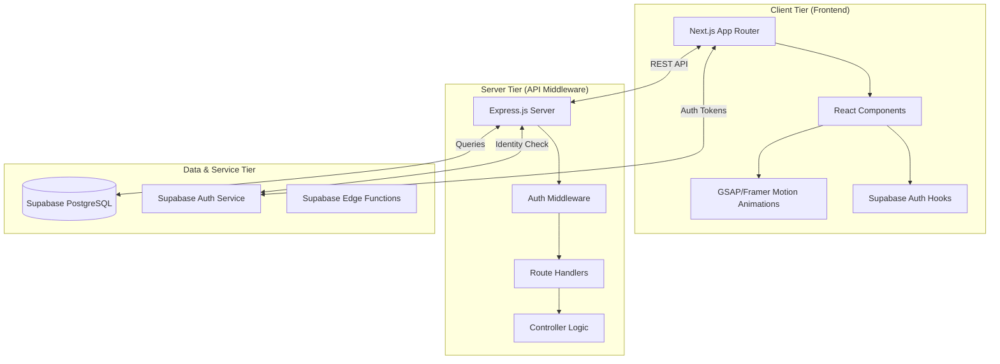
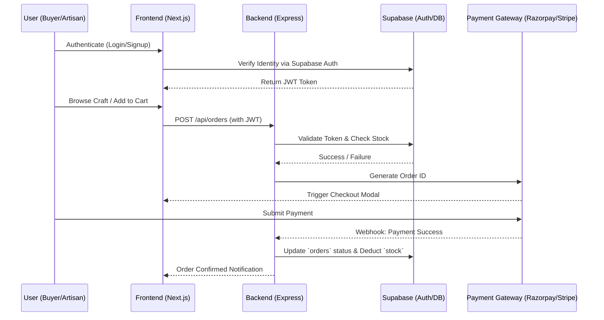
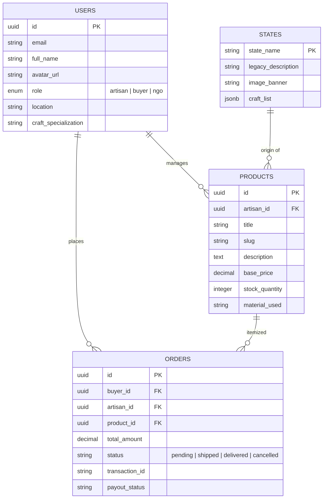

<div align="center">
  
  <h1>RangManch: India's Direct-to-Artisan Marketplace</h1>
  <p><strong>Empowering Craftsmen via Next.js, Supabase, and PostgreSQL</strong></p>
  <p><i>A "Legacy-as-a-Service" platform bridging the gap between rural artisans and global conscious consumers.</i></p>

  <p>
    
    
    
    
  </p>
</div>

---

## 📖 Table of Contents
1. [Executive Summary](#-executive-summary)
2. [The Problem & Our Solution](#-the-problem--our-solution)
3. [High-Level System Architecture](#%EF%B8%8F-1-high-level-system-architecture)
4. [Tech Stack](#-2-tech-stack)
5. [Data Flow & Transaction Lifecycle](#-3-data-flow--transaction-lifecycle)
6. [Database Schema](#-4-database-schema-relational-model)
7. [Key Functional Modules](#-5-key-functional-modules)
8. [Security & Performance](#%EF%B8%8F-6-security--performance-design)
9. [Development Roadmap](#-7-development-roadmap)
10. [Local Setup Instructions](#%EF%B8%8F-8-local-setup-instructions)
11. [Coding Conventions & Design Philosophy](#-9-coding-conventions--design-philosophy)

---

## 🚀 Executive Summary
Rangmanch is a specialized digital marketplace designed to bridge the gap between rural artisans and global consumers. Operating as a next-generation "Legacy-as-a-Service" platform, it provides Indian artisans with a high-performance, cinematic marketplace using modern cloud infrastructure. By providing a decentralized, creator-first ecosystem, the platform brings previously localized art forms to a national and international audience.

## 🛑 The Problem & Our Solution

### Market Gaps
* **High Barriers to Entry:** Current platforms require high technical literacy, upfront GST registration, and complex inventory management.
* **Financial Exploitation:** Middlemen and high platform commissions eat up to 70% of actual profit margins.
* **Communication Deficit:** Lack of direct communication channels for custom orders or bulk negotiations.
* **Loss of Cultural Context:** Standard e-commerce treats handmade crafts as mere commodities, losing the rich legacy behind them.

### The RangManch Solution
Rangmanch provides a **"Zero-Barrier"** entry point featuring simplified mobile-first listings, localized regional discovery filters, and a dual-action commerce model that combines secure checkout with direct WhatsApp communication.

---

## 🏛️ 1. High-Level System Architecture

This diagram illustrates how the **Next.js frontend** interacts with the **Express backend** and **Supabase/PostgreSQL services**.



---

## 📦 2. Tech Stack

| Category | Technology |
| :--- | :--- |
| **Frontend Framework** | Next.js 14/15 (Server Components, ISR Edge Caching) |
| **UI & Styling** | React 19, Tailwind CSS, Lucide React, React Leaflet |
| **Animations** | GSAP, Framer Motion, React Spring (Parallax) |
| **Backend Environment**| Node.js, Express.js (TypeScript), Custom Middleware |
| **Database** | PostgreSQL (Hosted on Supabase), Node-Postgres (`pg`) |
| **Authentication** | Supabase Auth (GoTrue), RBAC (Role-Based Access Control) |
| **Payments** | Razorpay (India/UPI/RuPay) & Stripe (Global CC processing) |

---

## 🔄 3. Data Flow & Transaction Lifecycle

This flowchart tracks the journey from a user logging in to a purchase being finalized and payment being routed.



---

## 🧬 4. Database Schema (Relational Model)

Unlike NoSQL, our PostgreSQL ER-Diagram focuses on ACID compliance, strict data integrity, and complex relational mapping.



---

## ✨ 5. Key Functional Modules

### 🗺️ Cultural Heritage Navigator (Map Component)
An interactive Geo-Map built with `react-leaflet`. Users click on Indian states (e.g., Rajasthan) to trigger an optimized query to the `states_cultural_data` table, pulling curated lists of local crafts (like Blue Pottery or Sanganeri print) and active artisans.

### 🎭 Artisan Storytelling (Parallax)
Using `@react-spring/parallax`, we create an immersive "Digital Workshop". Users scroll vertically to see an artisan's process, tools, and materials in a cinematic horizontal layout.

### 🛍️ D2C Marketplace
* **Smart Search:** Utilizes PostgreSQL's native Full-Text Search (`tsvector`) to interpret queries, finding products by material, state, or technique despite misspellings.
* **Inventory Sync:** Real-time stock updates handled via database triggers and ACID transactions to prevent overselling of one-of-a-kind items.

### 🔐 Multi-Role Dashboards & Artisan Trust Verification
* **Artisan Portal:** Inventory management, sales tracking, and direct customer WhatsApp queries.
* **Buyer Portal:** Order history, tracking, and "Verification Badges" for craft authenticity.
* **NGO Inspectorate:** Oversight dashboard allowing registered NGOs to review, physically audit, and issue a prominent "Blue Check" authenticity badge to vetted artisan profiles.

---

## 🛡️ 6. Security & Performance Design

* **Edge Session Validation:** Next.js edge middleware evaluates Supabase session cookies before granting access to protected routes.
* **Row-Level Security (RLS):** Database-layer protection where artisans can only mutate their own listings, buyers have read-only access to public catalogs, and NGOs get specialized view capabilities.
* **Aggressive Indexing:** B-Tree indexing on primary/foreign keys and GIN (Generalized Inverted Index) on `JSONB` columns for sub-millisecond query results during festive season traffic spikes.
* **Edge Caching & CDNs:** Next.js ISR (Incremental Static Regeneration) dynamically caches heavy product pages globally, refreshing them in the background.

---

## 🗺️ 7. Development Roadmap

* **Phase 1 (Stabilization):** Complete rigorous migration to the PostgreSQL schema and establish base RLS policies.
* **Phase 2 (Visuals & UI/UX):** Enhance Parallax storytelling sections and implement the Heritage Navigator map.
* **Phase 3 (Mobile & Accessibility):** Progressive Web App (PWA) tailored for remote rural areas with low-bandwidth, enabling offline product draft creation.
* **Phase 4 (AI Integration):** Supabase Edge Functions linked with lightweight ML models for automated craft recognition, quality assurance, and image auto-tagging.

---

## 🛠️ 8. Local Setup Instructions

**Prerequisites**
* Node.js 18+
* A Supabase Project (URL & Anon Key)
* PostgreSQL (Active on Supabase)

### Step 1: Clone & Configure
```bash
git clone [https://github.com/your-repo/RangManch.git](https://github.com/your-repo/RangManch.git)
cd RangManch
```
Create a `.env` in both `/frontend` and `/backend`:
```env
# /frontend/.env.local
NEXT_PUBLIC_SUPABASE_URL=your_project_url
NEXT_PUBLIC_SUPABASE_ANON_KEY=your_anon_key

# /backend/.env
DATABASE_URL=your_postgresql_connection_string
PORT=5000
```

### Step 2: Install & Launch
**Frontend:**
```bash
cd frontend
npm install
npm run dev
```

**Backend:**
```bash
cd backend
npm install
npm run dev
```

---

## 🎨 9. Coding Conventions & Design Philosophy

### Conventions
* **TypeScript:** Strict mode enabled globally. Explicit interfaces/types for all APIs, DB schemas, and component props.
* **Commit Logic:** Enforced Atomic commits (e.g., `feat:`, `fix:`, `chore:`, `docs:`).
* **Environment Safety:** Absolute zero-trust policy. All secrets stay in `.env.local` and are ignored by Git.

### Design Philosophy
* **Aesthetic:** Neo-Traditional / Glassmorphic.
* **Color Palette:** Burnt Sienna (`#A0522D`), Saffron (`#F4C430`), and Deep Charcoal.
* **Typography:** *Outfit* for headers, *Inter* for readable body text.

---

## 👥 Team
**Team: AC-DC** (Hack Matrix Hackathon - VIT Bhopal, April 2026)
* **Rachit Tiwari** (24BAI10309)
* **Shaikh Mohammad Warsi** (24BAI10046)

## 📜 License
This project is licensed under the MIT License - see the LICENSE file for details.

---
*Built with ❤️ by Team AC-DC for India's Craftsmanship Revolution.*
